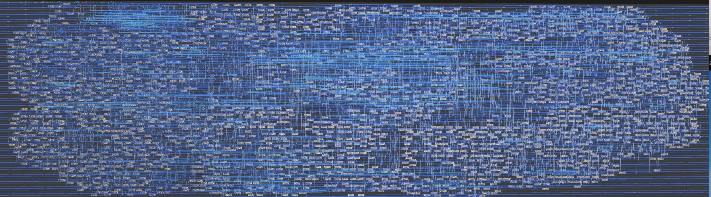

   


# FPGA/ASIC for low-precision 2.67 bits/param Neural Network accelerator

Inspired by low-precision weight investigation by Keller Jordan post: https://x.com/kellerjordan0/status/1837874116533407990, this implementation builds on top of 1.58 bit systolic array https://github.com/rejunity/tiny-asic-1_58bit-matrix-mul However instead of ternary weights it uses **septenary and quinary weights**.

Using septenary and quinary weights 3 weights can be stored in 1 byte - **2.67 bit per parameter**.

3 parameters are stored in 8 bits:
- 2 septenary {-2,-1,-.5,0,.5,1,2} and
- 1 quinary {-2,-1,0,1,2}

ASIC synthesis on 130 nm:


## Observations based on chip synthesis for 130 nm process
- A single 2.67bpp *(bit per param)* MAC unit is **~25% larger** in area than 1.58bpp ternary MAC unit.
- An array of 2.67bpp MAC units taking **the same area** as an array of 1.58bpp ternary MAC unit will provide **~20% less** operations per sec.
- Given the same memory bandwidth 2.67bpp array is **~40% slower**.

To outperform ternary:
- 2.76bpp compressed network must achieve the same classification performance with **~40% less parameters** i.e. 591 parameters instead of 1000 parameters OR
- given the same amount of netwok parameters 2.76bpp accelerator would need to be **75% larger in area** (probably x3 times more power consumption) to maintain the same inference speed!

## Code
**Septernary & quinary weight decoder.** Surprisingly a pretty 'dumb' approach to decoding produces a pretty compact logic.
```
  module unpack_775_weights(input      [7:0] packed_weights,
                            output reg [2:0] zero,
                            output reg [2:0] sign,
                            output reg [2:0] mul2,
                            output reg [2:0] div2);
      always @(*) begin
          case(packed_weights)
          8'd000: begin zero = 3'b111; sign = 3'b000; mul2 = 3'b000; div2 = 3'b000; end //     0    0    0
          8'd001: begin zero = 3'b011; sign = 3'b000; mul2 = 3'b000; div2 = 3'b000; end //     1    0    0
          8'd002: begin zero = 3'b011; sign = 3'b000; mul2 = 3'b100; div2 = 3'b000; end //     2    0    0
          8'd003: begin zero = 3'b011; sign = 3'b100; mul2 = 3'b000; div2 = 3'b000; end //    -1    0    0
          8'd004: begin zero = 3'b011; sign = 3'b100; mul2 = 3'b100; div2 = 3'b000; end //    -2    0    0
          8'd005: begin zero = 3'b101; sign = 3'b000; mul2 = 3'b000; div2 = 3'b010; end //     0  0.5    0
          8'd006: begin zero = 3'b001; sign = 3'b000; mul2 = 3'b000; div2 = 3'b010; end //     1  0.5    0
          8'd007: begin zero = 3'b001; sign = 3'b000; mul2 = 3'b100; div2 = 3'b010; end //     2  0.5    0
          // ...
```

**Septenary math.** Multiply accumulate unit are implemented as septenary weight (E2M0 format) multiplied by INT8 activation and accumulated in INT18.
```
            // sign extend to 9-bit before arithmetic shifts
            wire signed [8:0] act = $signed({arg_top_curr[7], arg_top_curr[7:0]});
            wire signed [8:0] addend =
                mul2 ?  act <<< 1:
                div2 ?  act >>> 1:
                        act;

                assign accumulators_next[i*W+W-1] =
                     zero   ? accumulators[i*W+j] + 0 :
                    (sign   ? accumulators[i*W+j] - addend :
                              accumulators[i*W+j] + addend);
```


**Systolic array.** Both inputs (weights & activations) are stationary. Accumulators are double buffered and results are shifted out of the array in a systolic manner. Such approach is closer to Tesla FSD rather than a Google's TPU.

## Measurements

Sizes of the currently synthesized and measured systolic arrays using OpenLane and eFabless 130nm PDK via [Tiny Tapeout](https://tinytapeout.com):
- 1.58bpp - 5x1 .. 30x6 grids
- 2.67bpp - 3x1 .. 21x7 grids


## Intent & ASIC
Low-precision weight is inspired by Keller Jordan post: https://x.com/kellerjordan0/status/1837874116533407990 This implementation is an exploration of the design space - intent is to measure how chip area, precsion and memory bandwidth affects the performance of the systolic array and AI accelerators.

This ASIC will be fabricated using eFabless 130 nm process via [Tiny Tapeout](https://tinytapeout.com).

# ASIC 1.58 bit aka TERNARY weight LLMs 

See [The Era of 1-bit LLMs: All Large Language Models are in 1.58 Bits](https://arxiv.org/pdf/2402.17764.pdf) paper that reduces weights of the [Large Language Model](https://en.wikipedia.org/wiki/Large_language_model) to ternary representation `{-1, 0, 1}`.


# What is Tiny Tapeout?

TinyTapeout is an educational project that aims to make it easier and cheaper than ever to get your digital designs manufactured on a real chip.

To learn more and get started, visit https://tinytapeout.com.
- [FAQ](https://tinytapeout.com/faq/)
- [Digital design lessons](https://tinytapeout.com/digital_design/)
- [Join the community](https://tinytapeout.com/discord)
